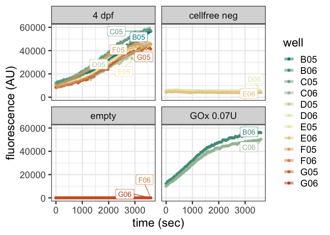
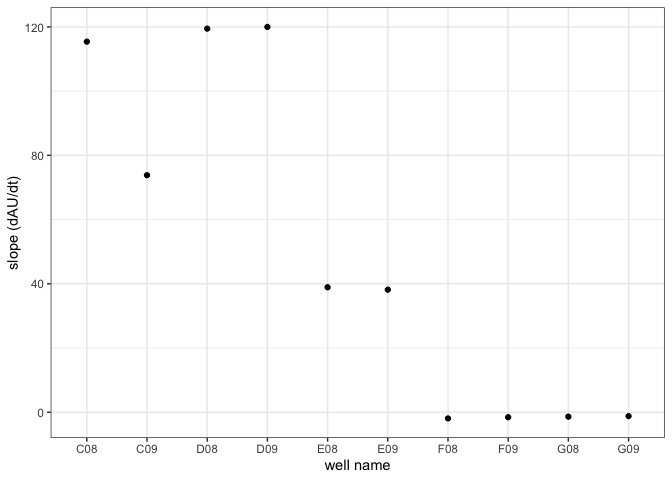
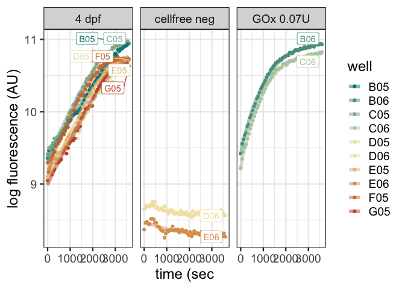
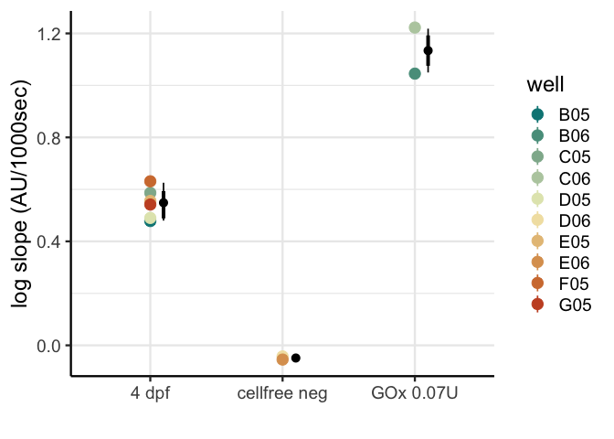

<!-- README.md is generated from README.Rmd. Please edit that file -->

# mitoXpress

<!-- badges: start -->
<!-- badges: end -->

Vincent de Boer, March 23rd, 2023

🔬 🤖 🥼

This is an import and analysis script written for TRF mitoXpress
experiments ran on a SpectraMax. Please have a good look at the data
file and key file.

## Install

For the script to run the following libraries are needed:

``` r
library(tidyverse)
library(broom)
library(here)
library(janitor)
library(lubridate)
library(readxl)
library(bayestestR)
library(pspline)
library(colorspace)
library(ggrepel)
library(ggdist)
```

Also the renv lockfile in this repository is up to date with all
packages that are used in this project.

This repository can be cloned to your own github page or the files can
be copied to your own Rstudio project.

## Input

The data and key files are living in the folder `inst\extdata`.

### Data file

A data file starts its data column names on row three. The script skips
the first two lines. The file contains a `Time` column and a
`Temperature` column followed by one column for each `well`. The script
removes rows that contain `NaN` and also removes the closing rows of the
documents.

The data file is a tab-delimited text file. Apparently our Spectramax
spits out txt files in UTF16 unicode format, which is somewhat outdated,
since practically all unicode text files now are encoded as UTF8. This
is likely the reason why Excel has difficulty reading the exported files
from the spectramax properly.

The tab-delimited text column names are also renamed. Please notice that
well names need to be three characters, so `A1` becomes `A01`. This
conversion is also incorporated in the script since the plate reader
outputs two and three digit well names. This is annoying when sorting
data and plotting data.

The imported and processed data looks like this in R:

``` r
mito_express_data
#> # A tibble: 610 × 5
#>    time     time_sec  temp well  fluorescence
#>    <Period>    <dbl> <dbl> <chr>        <dbl>
#>  1 0S              0    27 C08         42318.
#>  2 0S              0    27 C09         50590.
#>  3 0S              0    27 D08         27063.
#>  4 0S              0    27 D09         27544.
#>  5 0S              0    27 E08         13598.
#>  6 0S              0    27 E09         12513.
#>  7 0S              0    27 F08          9162.
#>  8 0S              0    27 F09          8408.
#>  9 0S              0    27 G08          7690.
#> 10 0S              0    27 G09          8232.
#> # … with 600 more rows
```

### Key file

The `key file` is needed for the user to manually add meta info to the
analysis. The most important is the choice for time frame for `slope`
calculation. The time frame is given in seconds (`start` and `end`).
Also `sample_type` and `group` information should be added.

The key file is an excel file (.xlsx file).

The key file in R looks like:

``` r
key_file
#> # A tibble: 10 × 6
#>    well  sample_type      group              window  start   end
#>    <chr> <chr>            <chr>              <chr>   <dbl> <dbl>
#>  1 C08   sample           GOx 10U            window1     0   120
#>  2 C09   sample           GOx 10U            window1     0   120
#>  3 D08   sample           GOx 5U             window1     0   120
#>  4 D09   sample           GOx 5U             window1     0   120
#>  5 E08   sample           GOx 1U             window2   300   780
#>  6 E09   sample           GOx 1U             window2   300   780
#>  7 F08   blank no enzyme  GOx 0U             window2   300   780
#>  8 F09   blank no enzyme  GOx 0U             window2   300   780
#>  9 G08   blank no glucose GOx 10U no glucose window2   300   780
#> 10 G09   blank no glucose GOx 10U no glucose window2   300   780
```

## Plots

### raw data with smoothed spline

The first plot is the raw data traces with the smoothed spline.

``` r
transformed <- readRDS(here::here("data", "transformed_4dpf_example.rds"))

transformed %>%
  ggplot(aes(x=time_sec, y = (fluorescence), color = well, group = group))+
  geom_point()+
  geom_line(aes(y = (zero_order), color = well, group = well),
            alpha = 0.5,
            linewidth = 2)+
  ggrepel::geom_label_repel(data = . %>% filter(time_sec == max(time_sec)),
                            aes(label = well),
                            show.legend = FALSE)+
  colorspace::scale_colour_discrete_divergingx(palette = "Geyser", rev = FALSE)+
  labs(y = "fluorescence (AU)",
       x = "time (sec)") +
  facet_wrap(~group, scales = "fixed")+
  theme_bw(base_size = 18)
```

<!-- -->

### first order derivative of the smoothed spline

The second plot is the first derivative of the smoothed spline, it
demosntrated were the maximum slope is.

``` r
transformed %>%
  ggplot(aes(x=time_sec, y = first_order, color = well, group = group))+
  geom_point()+
  ggrepel::geom_label_repel(data = . %>% filter(time_sec == max(time_sec)),
                            aes(label = well),
                            show.legend = FALSE)+
  colorspace::scale_colour_discrete_divergingx(palette = "Geyser", rev = FALSE)+
  labs(y = "change in fluorescence (1st der.)",
       x = "time (sec)") +
  facet_wrap(~group, scales = "fixed")+
  theme_bw(base_size = 18)
```

<!-- -->

### log transformed data

This is just a plot of the log transform of the smoothed spline.

<!-- -->

### slopes

Here the slopes are plotted for each well and plotted for each group as
individual points and as point_interval (see also ggdist package). The
dot is the median of the datapoints, the thick bar is where 95% of the
data is and the thin bar is where 80% of the data is.

``` r
transformed %>%
  filter(!group %in% c("empty")) %>%
  slice(1, .by = well) %>%
  ggplot(aes(x=group, y = log_slope_till_max, color = well, group = group))+
  geom_point(size = 4)+
  ggdist::stat_pointinterval(position = position_dodge(width = -0.4, preserve = "single"))+
  colorspace::scale_colour_discrete_divergingx(palette = "Geyser", rev = FALSE)+
  labs(y = "log slope (AU/1000sec)",
       x = "") +
  theme_bw(base_size = 18)+
  theme(panel.border = element_blank(),
        axis.line.y = element_line(),
        axis.line.x = element_line())
```

<!-- -->

## Explanation of calculations

The data processing goed through several steps. It uses the
`smooth.Pspline` from the `Psline` package. The smoothing parameters
(spar = 0.8 and method = 2) are set. The zero-order and first_order
splines are then processed and stored in the `transformed` tibble. Also,
the area under the curve (AUC) is calculated and the original slope in
the range from time_sec = 800 (s) to time_sec = 2800 (s) is calculated.
These are not used anymore.

To steps that are taken in the prcosssing are presented here:


/Users/vincentdeboer/Documents/R/mitoXpress/mitoXpress_data_analysis_long.png
